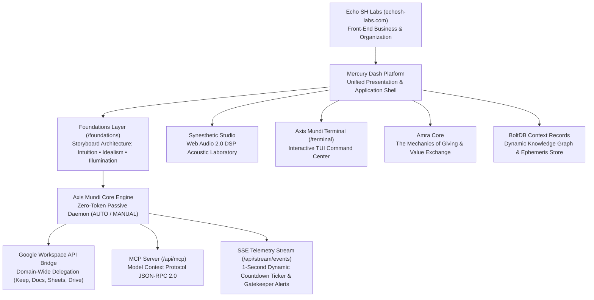

# Mercury Dash (Amra Core & Foundations Platform)

> **Organization:** [Echo SH Labs](https://echosh-labs.com) (`echosh-labs.com`)  
> **Author & Architect:** Justin Andrew Wood  
> **Core Engine:** Axis Mundi (Zero-Token Google Workspace / Keep Ingestion & MCP Daemon)  
> **Value Mechanics:** Amra Core (The Architecture of Giving)  
> **Tech Stack:** Go 1.22 (`bbolt`, `pgx`, `chi`), Next.js 14 (App Router), Web Audio 2.0 DSP, Server-Sent Events (SSE)

A unified esoteric, philosophical, and autonomous operational platform operated by **Echo SH Labs**. Mercury Dash integrates the Foundations consciousness storyboard, real-time procedural DSP acoustics, and the **Axis Mundi** zero-token autonomous operational engine.

---

## 🏛️ System Layers & Organization



---

## 🌌 Core Components

### 1. Echo SH Labs (`echosh-labs.com`)
The operational business entity stewarding the platform, research archives, and open protocols.

### 2. Foundations Storyboard (`/foundations`)
The narrative and architectural core of the platform:
- **01 / Intuition (432 Hz Harmonic):** The inner staircase; stillness and sensory calibration.
- **02 / Idealism (528 Hz Solfeggio):** The ascent of aspiration; structural purpose and sacred geometry.
- **03 / Illumination (141.27 Hz Mercury Quicksilver):** Radiant consciousness and unified clarity.

### 3. Axis Mundi Core Operational Engine (`internal/axismundi/`)
The foundational operational infrastructure running continuously in the background:
- **Zero-Token Passive Gatekeeper:** Ingests voice notes and written instructions from Google Keep without consuming AI tokens.
- **Dual-Mode Control Engine:**
  - **`AUTO`:** Continuous background polling with dynamic frequency (`10s`, `30s`, `60s`, `120s`, `300s`) and live countdown ticker.
  - **`MANUAL`:** On-demand synchronization via `/api/axismundi/keep/sync` or keyboard shortcut `[S]`.
- **Auto-Ingest Policy:**
  - **`EXECUTE`:** Incoming notes with `#amra-exec` or tagged intent are queued directly for agent execution (`QUEUED_FOR_AGENT`).
  - **`PENDING`:** Passive contextual review (`PASSIVE_CONTEXT`).
- **MCP Server (`/api/mcp`):** Native Model Context Protocol JSON-RPC 2.0 server enabling AI agents to query directives, update lifecycle statuses, trigger Keep syncs, and modify system modes.
- **Interactive TUI Console (`/terminal`):** Real-time web-based terminal user interface with full keyboard shortcuts matrix, 3D C60 Buckyball wireframe, live SSE telemetry, and item inspector drawer.

### 4. Amra Core (The Architecture of Giving)
The core mechanics of giving, value flow, and reciprocal energy exchange, preserved within BoltDB for future expansions.

### 5. BoltDB & Context Graph (`backend/data/mercury_context.db`)
High-performance embedded B+Tree key-value database storing the contextual knowledge graph, dynamic relations, 17-year Dasha cycles, and the author's opus.

---

## 🚀 Quick Start & Developer Workflows

The platform is managed via a standardized `Makefile` and script suite in `scripts/`:

### 1. Automated Test Suite (Go Race Tests + Vitest + 22 HTTP Route Contract Assertions)
```bash
make test
# or: bash scripts/test.sh
```

### 2. Live Development Mode (Go Backend on :8080 + Next.js Hot-Reload on :3000)
```bash
make dev
# or: bash scripts/dev.sh
```

### 3. Production Build (Single 11MB Binary with Embedded UI)
```bash
make build
# or: bash scripts/build.sh
```

### 4. Run Standalone Singular Binary
```bash
make run
# or directly: ./mercury-dasha-server -port 3000
```

### 5. Clean Environment & Release File Locks
```bash
make clean
# or: bash scripts/clean.sh
```

---

## 📡 API & Protocol Endpoints

### Axis Mundi & MCP Engine
| Endpoint | Method | Description |
| :--- | :--- | :--- |
| `/api/axismundi/directives` | `GET` | List all stored directives in registry |
| `/api/axismundi/directives/pending` | `GET` | Filtered list of queued `[EXECUTE]` directives |
| `/api/axismundi/directives/{id}/status` | `POST` | Update directive status & execution log |
| `/api/axismundi/directives/{id}` | `DELETE` | Permanently delete a directive |
| `/api/axismundi/workspace/status` | `GET` | Google Workspace auth & Domain-Wide Delegation status |
| `/api/axismundi/mode` | `GET` / `POST` | Get or set engine mode (`AUTO`/`MANUAL`), policy (`EXECUTE`/`PENDING`), and `poll_interval_sec` |
| `/api/axismundi/keep/sync` | `GET` / `POST` | Trigger immediate on-demand Google Keep sync |
| `/api/stream/events` | `GET (SSE)` | Real-time Server-Sent Events stream (tick countdown, telemetry, execution alerts) |
| `/api/mcp` | `POST` | Model Context Protocol JSON-RPC 2.0 interface |

### Foundations & Mercury Core
| Endpoint | Method | Description |
| :--- | :--- | :--- |
| `/api/health` | `GET` | Health check and datastore status (BoltDB + Postgres) |
| `/api/foundations/narrative` | `GET` | Foundations narrative staircase (Intuition, Idealism, Illumination) |
| `/api/audio/presets` | `GET` | Synesthetic audio presets and planetary frequencies |
| `/api/statement` | `GET` | Singular foundational statement on Mercury |
| `/api/context` | `GET` | Knowledge graph nodes from BoltDB |
| `/api/dasha` | `GET` | 17-Year Mercury Mahadasha and 9 Antardashas |
| `/api/nakshatras` | `GET` | 3 Mercurial Nakshatras (*Ashlesha*, *Jyeshtha*, *Revati*) |
| `/api/alchemical` | `GET` | Tria Prima and Quicksilver alchemical properties |
| `/api/author` | `GET` | Author bio, treatises, and chronological milestones |

---

## ⌨️ Axis Mundi Terminal Keyboard Shortcuts

| Key | Action |
| :--- | :--- |
| `[A]` | Switch engine to `AUTO` mode (background polling) |
| `[M]` | Switch engine to `MANUAL` mode (on-demand only) |
| `[E]` / `[P]` | Toggle Auto-Ingest Policy between `EXECUTE` and `PENDING` |
| `[S]` | Trigger immediate Google Keep API synchronization |
| `[R]` | Refresh registry and system state |
| `[H]` | Toggle Help & API Reference Overlay Modal |
| `[↑]` / `[↓]` | Navigate highlighted directive in registry list |
| `[Enter]` / `[Space]` | Open Item Inspector Drawer |
| `[1]` - `[5]` | Quick status shortcut (`[1]` Pending, `[2]` Execute, `[3]` Run, `[4]` Done, `[5]` Archive) |
| `[Del]` / `[Bksp]` | Purge selected directive |
| `[Esc]` | Close Inspector Drawer or Help Modal |

---

## 📜 License & Organization

Operated by **Echo SH Labs** (`echosh-labs.com`).  
Authored by **Justin Andrew Wood**.  
&copy; 2026 Echo SH Labs. All rights reserved.
